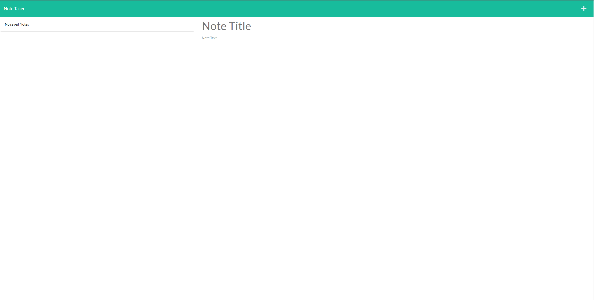

# Note-Taker

## Description

This is a basic note taker app that allows you to save note for later with a title. 

## Requirements

Node.js with the express package.

## Installation

Run npm install, then node server.js in your terminal. Proceed to open http://localhost:3001 in your browser. The app is also avaible live on Heroku.

## Heroku Link/GitHub Link

https://dashboard.heroku.com/apps/agile-harbor-48863

https://github.com/Obtains/Note-Taker

## Screenshot

